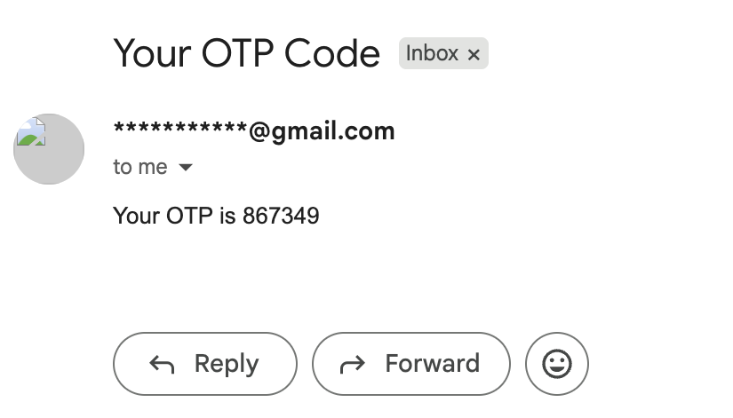

# Minimal Django Authentication with OTP Verification

## Overview

This project is a minimal and beginner-friendly Django authentication system that implements email-based OTP (One-Time Password) verification for user signup.

It demonstrates a clean flow for:

* User registration  
* OTP generation and verification  
* Secure login after verification  

---

## Features

* User signup with email and password  
* OTP generation and validation  
* Email-based verification (via Brevo API)  
* Login and logout functionality  
* Masked email display for better privacy  
* Clean and minimal backend structure  

---

## Tech Stack

* Django  
* SQLite  
* Anymail (Brevo integration)  
* Python-dotenv  

---

## Setup Instructions

### 1. Clone the repository

```bash
git clone git@github.com:lobsangshakya/user_auth.git
cd <your-project-folder>
```

### 2. Create virtual environment

```bash
python3 -m venv newenv
source newenv/bin/activate
```

### 3. Install dependencies

```bash
pip install -r requirements.txt
```

### 4. Create `.env` file

Create a `.env` file in the root directory and add:

```env
SECRET_KEY=your_secret_key
DEBUG=True
BREVO_API_KEY=your_brevo_api_key
DEFAULT_FROM_EMAIL=your_email@gmail.com
```

### 5. Apply migrations

```bash
python manage.py makemigrations
python manage.py migrate
```

### 6. Run server

```bash
python manage.py runserver
```

---

## Usage

* Register using your email  
* Receive OTP via email  
* Verify account  
* Login and access dashboard  

---

## Screenshots

### OTP Email


### Dashboard


---

## Notes

* Email functionality depends on Brevo account activation  
* For development/demo, OTP can be displayed locally if email sending is restricted  
* Make sure your sender email is verified in Brevo  

---

## Security

* Sensitive data is stored in `.env` file  
* `.env` is excluded from version control  
* API keys are not exposed  
* Email masking is implemented for user privacy  

---

## License

This project is for educational purposes.